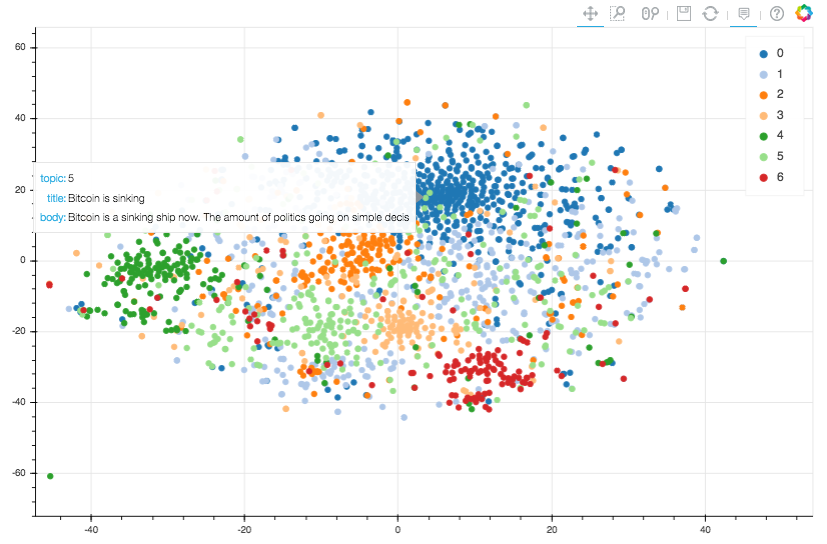
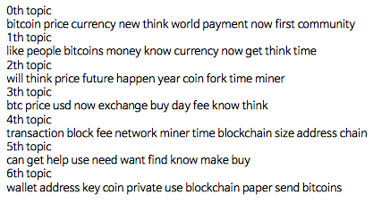

# Topic modeling & visualization with bitcoin

## Introduction
* After topic modeling (Nonnegative matrix factorization; NMF) with bitcoin forum data, I visualized scatter plot using t-SNE and Bokeh.

## Dependencies
* Anaconda python 3.6
* Library
	- pip install ujson (만약 설치 안되면 넘어가도 괜찮습니다.)
	- pip install stop_words
	- python 실행 후
		- import nltk
		- nltk.download() 실행 후 wordnet 설치

## Results
### t-SNE visualization with Bokeh library

### topic keywords extracted from topic modeling

